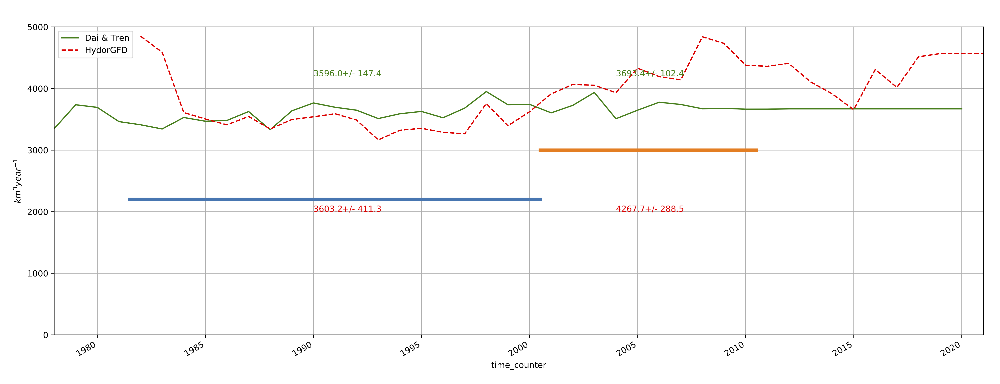

## Notebook used to control the HYROGFD data set extracted from ANHA4 on the CREG025.L75 grid and compared to Dai et al. one 
>
> The overall HYDRO product has the same order of magnitude than Dai et al. with more IA variability  
> This has been done on Datarmor: /home1/datahome/ctalandi/DEV/FREDY/CONFIGS/CREG025.L75/HYDROGFD-RUNOFF  
> It relies on the CREG025.L75_domain_cfg.nc input grid file and few output time-series are available under the DATA directory 
> The HydroGFD runoffs have been spread on the CREG12.L75 grid  

  

Yearly time series of mean runoff over an Arctic box (following Haine et el 2015 ref.) for the HYDROGFD and Dai data set on CREG025 grid 

